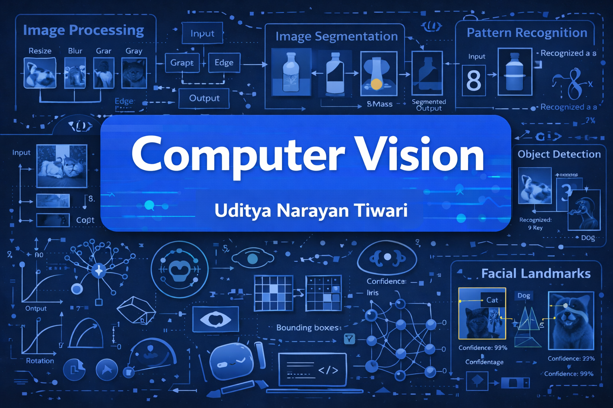

# 📷 Computer Vision with CNN & Object Detection (TensorFlow & PyTorch)


## 📌 Overview
Welcome to **Complete Computer Vision**, a hands-on course and code repository focused on learning fundamental and advanced techniques in computer vision using **OpenCV**, **TensorFlow**, and **PyTorch**.

This repository is part of my learning and teaching journey in AI & Machine Learning as a **B.Tech CSE (AI & ML)**

In this comprehensive course, you will master the fundamentals and advanced concepts of computer vision, focusing on Convolutional Neural Networks (CNN) and object detection models using TensorFlow and PyTorch. This course is designed to equip you with the skills required to build robust computer vision applications from scratch.

---

## ✅ Prerequisites

* Basic Python programming
* Fundamental understanding of Machine Learning (recommended)
* Familiarity with NumPy and basic linear algebra is a plus

---

## 🎯 Course Objectives

* Understand the fundamentals of computer vision and image data
* Master CNN architectures and deep learning concepts
* Implement state-of-the-art object detection and segmentation models
* Build end-to-end real-world computer vision projects
* Gain practical experience with TensorFlow and PyTorch

---

## 📚 What You Will Learn

### 🔹 1. Introduction to Computer Vision

* Understanding image data and its structure
* Pixel values, channels, and color spaces (RGB, Grayscale, HSV)
* Image loading, visualization, and preprocessing
* Using OpenCV for image manipulation

---

### 🔹 2. Deep Learning Fundamentals for Computer Vision

* Basics of Neural Networks
* Deep Learning concepts for image-based tasks
* Backpropagation and gradient descent
* Activation functions, loss functions, and optimizers

---

### 🔹 3. Convolutional Neural Networks (CNN)

* CNN architecture and working principle
* Convolution layers, pooling layers, and padding
* Fully connected layers and classification heads
* Implementing CNN models using:

  * TensorFlow
  * PyTorch

---

### 🔹 4. Data Augmentation and Preprocessing

* Importance of data augmentation
* Improving model generalization
* Techniques such as:

  * Rotation, flipping, scaling, cropping
* Libraries covered:

  * imgaug
  * Albumentations
  * TensorFlow Data Pipeline

---

### 🔹 5. Transfer Learning for Computer Vision

* Understanding transfer learning
* Using pre-trained CNN models
* Models covered:

  * VGG
  * ResNet
  * EfficientNet
* Fine-tuning and optimization strategies

---

### 🔹 6. Object Detection Models

* Fundamentals of object detection
* Bounding boxes and evaluation metrics (IoU, mAP)
* Object detection algorithms:

  * YOLO (You Only Look Once)
  * Faster R-CNN
* Implementation using TensorFlow and PyTorch

---

### 🔹 7. Image Segmentation Techniques

* Difference between classification, detection, and segmentation
* Semantic segmentation
* Instance segmentation
* Models implemented:

  * U-Net
  * Mask R-CNN

---

### 🔹 8. Real-World Projects & Applications

Hands-on projects included in this course:

* Face detection and recognition system
* Real-time object detection using webcam
* Image classification pipeline
* End-to-end model training and evaluation
* Basic deployment-ready workflows

---

## 🛠️ Tech Stack & Tools

* Python
* TensorFlow
* PyTorch
* OpenCV
* NumPy & Pandas
* Matplotlib & Seaborn
* Albumentations / imgaug
* Jupyter Notebook

---

## 🛠️ Usage & Setup

### 🧠 Clone the repository

```bash
git clone https://github.com/udityamerit/Complete-Computer-Vision.git
cd Complete-Computer-Vision
```

### 📦 Install dependencies

```bash
pip install -r requirements.txt
```

### 🏁 Start learning

Open the Jupyter notebooks in `notebooks/` and follow the step-by-step tutorials.

---

## 🚀 Who Should Take This Course?

* Computer Science students
* AI & Machine Learning enthusiasts
* Data Scientists
* Developers interested in computer vision
* Anyone looking to build practical CV projects


---

## 📌 Learning Outcomes

By the end of this course, you will be able to:

* Design and train CNN models from scratch
* Use transfer learning effectively
* Build object detection and segmentation systems
* Work on real-world computer vision applications
* Confidently use TensorFlow and PyTorch for CV tasks

---

## ⭐ Future Enhancements

* Model deployment with FastAPI / Flask
* Edge AI and mobile deployment
* Advanced vision transformers (ViT)
* Multi-object tracking

---

## 🤝 Contributing

Contributions are welcome! Feel free to fork this repository, create a new branch, and submit a pull request.

---

## 👤 Author

**Uditya Narayan Tiwari**
B.Tech – Computer Science & Engineering (AI & ML)
VIT Bhopal University

🔗 **Portfolio:** [https://udityanarayantiwari.netlify.app/](https://udityanarayantiwari.netlify.app/)

🔗 **GitHub:** [https://github.com/udityamerit](https://github.com/udityamerit)

🔗 **Knowledge Base:** [https://udityaknowledgebase.netlify.app/](https://udityaknowledgebase.netlify.app/)

🔗 **LinkedIn:** [https://www.linkedin.com/in/uditya-narayan-tiwari-562332289/](https://www.linkedin.com/in/uditya-narayan-tiwari-562332289/)

---

## 📬 Contact

For collaboration, feedback, or academic discussions, feel free to connect via LinkedIn or GitHub.

---

### 🌟 If you find this repository helpful, don’t forget to star it and share it with fellow learners!
